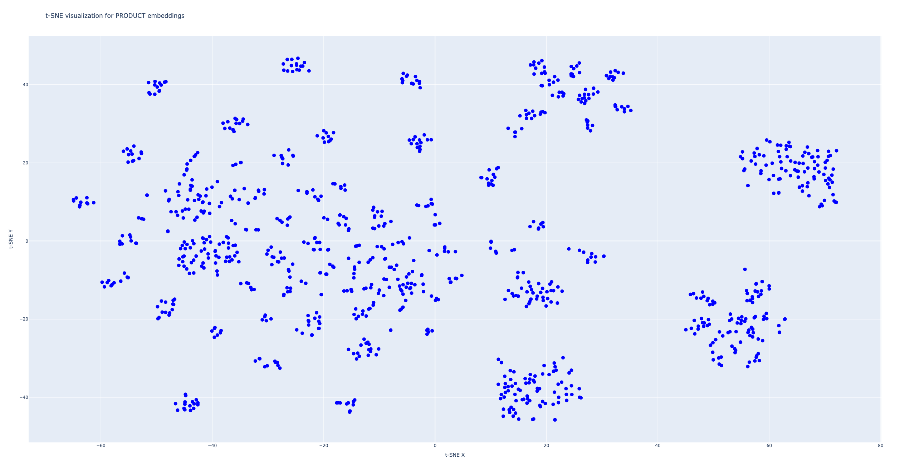

# Recommendation System

## Overview

This project implements a personalized recommendation system that leverages user and product data to provide tailored recommendations. The system uses a Qdrant vector database to perform similarity searches. When a recommendation is requested for a specific user, the system first identifies similar users based on their interactions with products, purchases, and reviews. It then constructs a hypothetical product profile by aggregating the characteristics of all products that these similar users (including the current user) have interacted with. A similarity search is then conducted within the product vector collection to find products most similar to this aggregated profile. The resulting product recommendations are further refined using basic filtering logic to ensure relevance.

## Getting Started

Install Python 3.9.

Create a virtual environment in the base folder:

```
python -m venv .venv
```
If Python 3 is not default on the system, the command may be `python3`.

Activate the virtual environment and install the dependencies:
```
source .venv/bin/activate
pip install -r requirements.txt
```

## Project Structure

- `data_generation.py`: Generates synthetic datasets for users, products, user behaviors, and ratings.

- `data_visualisation.py`: Visualizes user and product embeddings using t-SNE for dimensionality reduction.

- `embeddings_generation.py`: Generates embeddings for users and products using a pre-trained transformer model.

- `global_config.py`: A Singleton class that manages the global configuration for the application, including data loading and vector database initialization.

- `product_approximation.py`: Computes the weighted average product embedding for a list of user IDs, used for product recommendation.

- `recommendation.py`: Contains the core logic for generating personalized recommendations for a user.

- `similarity_search.py`: Performs similarity search in a specified Qdrant collection using embeddings and returns the closest items.

- `test.py`: A script for testing the application.

## Testing the Application

To test the application and see how the recommendation system works, you can simply run the `test.py` file. This script includes all the necessary method calls from `recommendation.py`, which contains the core logic of the recommendation engine.

```
python test.py
```

This will execute the test script and display the output of the recommendation system based on the provided data.

## Visualizing Embeddings

If you want to check how the embeddings look and understand the relationship between users and products, you can run the `data_visualisation.py` file. This script will generate a t-SNE visualization of the embeddings, allowing you to see how the data clusters in a two-dimensional space.

```
python data_visualisation.py
```

This will display an interactive plot for both the user and product collections, allowing you to visually explore the embeddings and hover over points to reveal additional details.

Example of visualisation for product embeddings (this is not interactive, you need to run the script to be able to hover over points):

